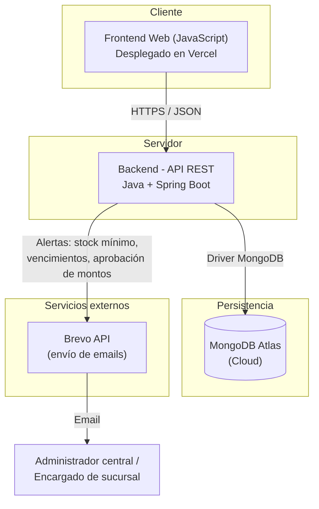
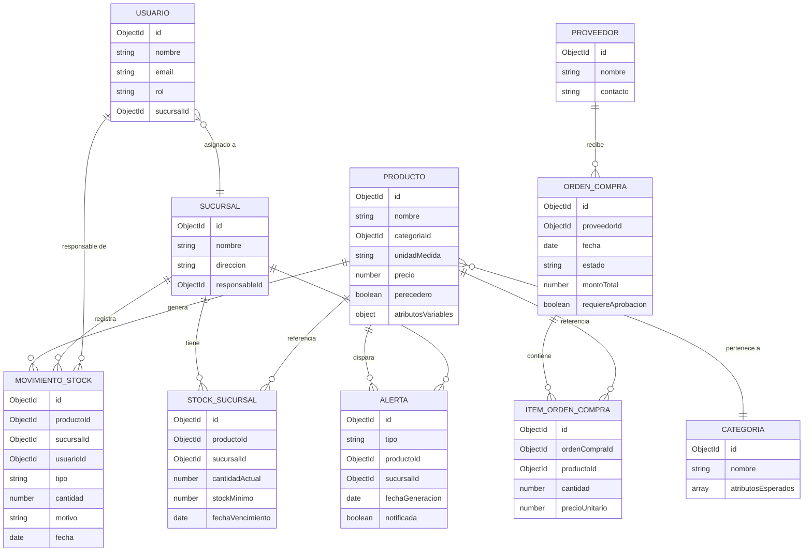
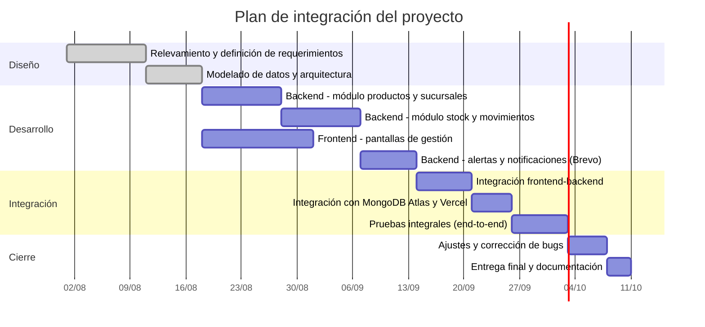

# Trabajo Final Integrador

## Grupo 214

Integrantes:

Agustina Aguilera
Gino Canevaro
Akier Aguirrezabala

## --Sistema de Gestión de Inventario Para Cadena de Almacenes--

### Descripción

Sistema de gestión de inventario para una pequeña cadena de almacenes que recientemente incorporó una tercera sucursal.

El crecimiento del negocio genera la necesidad de contar con una herramienta que permita centralizar la información de las distintas sucursales, mejorar el control de la mercadería y disponer de información útil para el análisis y la toma de decisiones.

### Problema

Con el crecimiento de la cadena, la gestión del inventario se vuelve más compleja. El control poco centralizado puede generar faltantes, exceso de stock, pérdidas por vencimiento y dificultades para planificar compras y analizar el comportamiento de los productos.

**Impacto estimado:** se estima que la falta de visibilidad centralizada entre sucursales genera aproximadamente entre un 10% y 15% de pérdidas mensuales por vencimientos no detectados a tiempo y quiebres de stock, además de horas de trabajo administrativo destinadas a conciliar información entre sucursales de forma manual.

### Actores y roles

- **Administrador central:** gestiona productos, categorías, sucursales y proveedores; accede a reportes consolidados de toda la cadena para la toma de decisiones.
- **Encargado de sucursal:** registra entradas y salidas de mercadería en su sucursal, consulta el stock local y recibe alertas de stock mínimo.
- **(Rol a futuro) Proveedor:** podría integrarse en una etapa posterior para la gestión de compras, actualmente fuera del alcance del MVP.

### Objetivo

Desarrollar un sistema que permita mejorar la gestión del inventario de las distintas sucursales y facilitar el acceso a información confiable para la gestión y el análisis del negocio.

---

## Funcionalidades previstas

Entre las principales funcionalidades que se contemplan inicialmente se encuentran:

- Gestión de productos y categorías.
- Gestión de sucursales.
- Control de stock por sucursal.
- Registro de entradas y salidas de mercadería.
- Gestión de proveedores y compras.
- Alertas de stock mínimo y vencimientos.
- Reportes y análisis de información del negocio.

El alcance y las funcionalidades podrán ajustarse durante el desarrollo en función de las necesidades del proyecto y las decisiones tomadas por el equipo.

---

## MVP

La primera versión del sistema contemplará:

- Alta y gestión de productos.
- Gestión de sucursales.
- Control de stock por sucursal.
- Registro de entradas y salidas de mercadería.
- Configuración de stock mínimo.
- Alerta cuando el stock alcance el mínimo establecido.

---

## Requerimientos

### Requerimientos funcionales

| ID | Requerimiento | Rol involucrado |
|----|----------------|------------------|
| RF-01 | Alta, baja y modificación de productos (nombre, categoría, unidad de medida, precio, atributos variables según categoría). | Administrador central |
| RF-02 | Alta, baja y modificación de categorías de producto. | Administrador central |
| RF-03 | Alta, baja y modificación de sucursales (nombre, dirección, responsable). | Administrador central |
| RF-04 | Registro de entradas de mercadería a una sucursal (compra, transferencia, devolución). | Encargado de sucursal |
| RF-05 | Registro de salidas de mercadería de una sucursal (venta, transferencia, merma, vencimiento). | Encargado de sucursal |
| RF-06 | Consulta de stock actual por producto y por sucursal. | Encargado de sucursal / Administrador central |
| RF-07 | Configuración de stock mínimo por producto y por sucursal. | Administrador central |
| RF-08 | Generación automática de alertas cuando el stock llega o cae por debajo del mínimo configurado. | Sistema |
| RF-09 | Envío de notificaciones por email ante alertas de stock mínimo, vencimiento próximo o aprobación de montos. | Sistema (vía Brevo) |
| RF-10 | Registro de fecha de vencimiento para productos perecederos. | Encargado de sucursal |
| RF-11 | Alta y gestión de proveedores. | Administrador central |
| RF-12 | Registro de órdenes de compra a proveedores. | Administrador central |
| RF-13 | Reportes consolidados de stock, movimientos y vencimientos entre todas las sucursales. | Administrador central |
| RF-14 | Autenticación y autorización de usuarios según rol. | Sistema |

### Requerimientos no funcionales

| ID | Requerimiento |
|----|----------------|
| RNF-01 | La aplicación web debe ser accesible desde navegadores de escritorio y adaptarse a distintos tamaños de pantalla. |
| RNF-02 | El sistema debe soportar el trabajo concurrente de múltiples sucursales sin inconsistencias en el stock. |
| RNF-03 | Los tiempos de respuesta de las operaciones habituales (consulta y registro de movimientos) no deben superar los 2-3 segundos en condiciones normales. |
| RNF-04 | El acceso a la información debe estar restringido según el rol del usuario (control de autorización). |
| RNF-05 | Las contraseñas y datos sensibles deben almacenarse de forma segura (hashing, variables de entorno para credenciales). |
| RNF-06 | El sistema debe ser escalable ante la incorporación de nuevas sucursales sin requerir cambios estructurales mayores. |
| RNF-07 | El código debe mantenerse versionado en un repositorio único centralizado en GitHub, con historial de commits trazable por integrante. |
| RNF-08 | El sistema debe estar desplegado y accesible públicamente (frontend en Vercel, backend expuesto vía API REST). |

---

## Reglas de negocio

1. **Stock nunca negativo:** no se permite registrar una salida de mercadería si el stock disponible en la sucursal es menor a la cantidad solicitada.
2. **Unicidad de producto por categoría:** un producto pertenece a una única categoría, y su conjunto de atributos variables depende de dicha categoría (por ejemplo, los productos de categorías perecederas requieren fecha de vencimiento obligatoria).
3. **Stock por sucursal, no global:** el stock se gestiona de forma independiente por sucursal; el stock consolidado a nivel cadena es una vista calculada, no un valor almacenado directamente.
4. **Alerta automática de stock mínimo:** cada vez que un movimiento de salida deja el stock de un producto en una sucursal igual o por debajo del mínimo configurado, el sistema debe generar una alerta y notificar al encargado de sucursal y al administrador central.
5. **Alerta de vencimiento:** los productos con fecha de vencimiento configurada generan una alerta preventiva cuando faltan N días para su vencimiento (parámetro configurable), permitiendo tomar acción antes de la pérdida.
6. **Trazabilidad de movimientos:** todo movimiento de stock (entrada o salida) debe quedar registrado con fecha, usuario responsable, sucursal, cantidad y motivo; los movimientos no se eliminan, solo se pueden anular mediante un movimiento de ajuste inverso.
7. **Roles y permisos:** un encargado de sucursal solo puede operar sobre el stock de su propia sucursal; el administrador central tiene visibilidad y permisos sobre todas las sucursales.
8. **Aprobación de montos:** las órdenes de compra o movimientos que superen un monto configurado requieren aprobación explícita del administrador central antes de confirmarse, y disparan una notificación por email.
9. **Consistencia entre entrada/salida y stock:** toda modificación de stock ocurre exclusivamente a través del registro de un movimiento; no se permite editar el valor de stock de forma directa.

---

## Arquitectura

Arquitectura de tres capas, con frontend y backend desacoplados y comunicación vía API REST.

**Capas:**

- **Frontend:** aplicación web en JavaScript, consume la API REST del backend, desplegada en Vercel.
- **Backend:** API REST en Java + Spring Boot, concentra la lógica de negocio (validación de stock, reglas de alertas, permisos por rol) y expone endpoints por recurso (productos, sucursales, stock, movimientos, proveedores, usuarios).
- **Persistencia:** MongoDB Atlas, con colecciones documentales que permiten esquemas flexibles según la categoría de producto.
- **Servicio externo:** integración con Brevo para el envío de notificaciones por email (alertas de stock, vencimientos, aprobación de montos).

---

## Estructura de datos

Modelo orientado a documentos (MongoDB). Se muestran las colecciones principales y sus relaciones lógicas (por referencia, no por clave foránea estricta).

**Notas sobre el modelo:**

- `atributosVariables` en `PRODUCTO` es un campo flexible (schema-less), aprovechando MongoDB para representar atributos distintos según la categoría (ej. fecha de vencimiento y lote para perecederos, garantía para electrónica, etc.), sin necesidad de tablas separadas por tipo de producto.
- `STOCK_SUCURSAL` separa el stock físico de la definición del producto, permitiendo que un mismo producto tenga cantidades y mínimos distintos en cada sucursal.
- `MOVIMIENTO_STOCK` funciona como registro histórico e inmutable (append-only); el stock actual en `STOCK_SUCURSAL` se actualiza como resultado de aplicar movimientos, nunca se edita directamente.
- `ALERTA` centraliza tanto las alertas de stock mínimo como las de vencimiento y aprobación de montos, facilitando el envío unificado de notificaciones vía Brevo.

---

## Decisiones técnicas

| Decisión | Justificación |
|----------|----------------|
| Frontend en JavaScript | Lenguaje ya conocido por el equipo, reduce curva de aprendizaje y acelera el desarrollo del MVP. |
| Backend en Java + Spring Boot | Framework maduro para lógica de negocio compleja (validaciones de stock multi-sucursal), tipado fuerte y ya visto en la carrera. |
| Base de datos MongoDB | Esquema flexible para productos con atributos variables según categoría, sin migraciones rígidas. |
| Arquitectura desacoplada (frontend/backend vía REST) | Permite desplegar y escalar cada capa de forma independiente (Vercel para frontend, backend propio para la API). |
| Repositorio único en GitHub | Cumple con el requisito de la cátedra y centraliza el control de versiones de todo el equipo. |
| Integración con Brevo para emails | Servicio externo simple de integrar vía API REST para notificaciones transaccionales, sin necesidad de infraestructura propia de envío de correo. |
| Movimientos de stock como registro inmutable | Garantiza trazabilidad y auditoría; evita inconsistencias por edición directa del stock. |

---

## Plan de integración

El desarrollo se organiza en fases incrementales, priorizando primero el MVP y luego las funcionalidades complementarias.

### Fases

1. **Diseño:** relevamiento de requerimientos, definición de reglas de negocio, modelado de datos (colecciones y relaciones lógicas) y diseño de la arquitectura general.
2. **Desarrollo:** implementación paralela de backend (por módulos: productos/sucursales, stock/movimientos, alertas) y frontend (pantallas de gestión), siguiendo el orden de prioridad del MVP.
3. **Integración:** conexión del frontend con la API REST, conexión del backend con MongoDB Atlas, despliegue en Vercel y configuración de la integración con Brevo para notificaciones.
4. **Pruebas:** pruebas funcionales sobre los flujos principales (alta de productos, movimientos de stock, generación de alertas) y pruebas de integración end-to-end.
5. **Cierre:** corrección de bugs detectados, ajustes finales y entrega de documentación.

---

## Riesgos y mitigaciones

| Riesgo | Mitigación |
|--------|------------|
| Inconsistencias de stock por operaciones concurrentes entre sucursales | Uso de operaciones atómicas de MongoDB para actualizar `STOCK_SUCURSAL` junto con la creación del `MOVIMIENTO_STOCK`. |
| Dependencia de un servicio externo (Brevo) para notificaciones críticas | Registrar toda alerta en la colección `ALERTA` independientemente del resultado del envío, permitiendo reintentos o consulta manual. |
| Falta de experiencia previa del equipo con MongoDB | Definir convenciones de modelado desde el inicio del proyecto y validarlas en la etapa de diseño. |
| Alcance que crece durante el desarrollo | Mantener el MVP como línea base y documentar cualquier funcionalidad adicional como "fuera de alcance" hasta una futura iteración. |

---

## Conclusión

El proyecto busca dar respuesta a un problema concreto y cuantificable del negocio: la falta de visibilidad centralizada del inventario entre sucursales, que hoy se traduce en pérdidas por vencimientos, quiebres de stock y trabajo administrativo evitable. La propuesta de solución —un sistema de gestión de inventario con arquitectura desacoplada (frontend en JavaScript, backend en Spring Boot y base de datos MongoDB)— fue definida priorizando tecnologías ya conocidas por el equipo, lo que permite enfocar el esfuerzo en la lógica de negocio propia del dominio (control de stock, alertas, trazabilidad) en lugar de en la curva de aprendizaje de nuevas herramientas.

El MVP definido cubre el núcleo mínimo necesario para operar: gestión de productos y sucursales, control de stock, registro de movimientos y alertas de stock mínimo. A partir de esa base, el plan de integración por fases permite incorporar de forma incremental la gestión de proveedores y compras, las alertas de vencimiento y los reportes consolidados, dejando además una puerta abierta para la incorporación futura del rol de proveedor como actor activo del sistema.

En conjunto, el diseño de arquitectura, el modelo de datos flexible y las reglas de negocio definidas buscan asegurar que el sistema no solo resuelva el problema actual de la cadena de tres sucursales, sino que también pueda escalar ante la incorporación de nuevas sucursales sin requerir cambios estructurales significativos.

---

## Repositorio

[https://github.com/Ginoc07/Trabajo_Final_Grupo214](https://github.com/Ginoc07/Trabajo_Final_Grupo214)

## Despliegue

Para el despliegue elegimos:

- **Vercel:** alojamiento de la aplicación web (frontend).
- **Spring Boot:** backend y API REST.

## Base de datos

MongoDB Atlas, base de datos alojada en la nube.

## API

Para la API, una de envío de emails (Brevo). La utilizaremos para enviar automáticamente alertas al responsable cuando un producto alcance o quede por debajo del stock mínimo establecido, caducidad y aprobación de montos.
