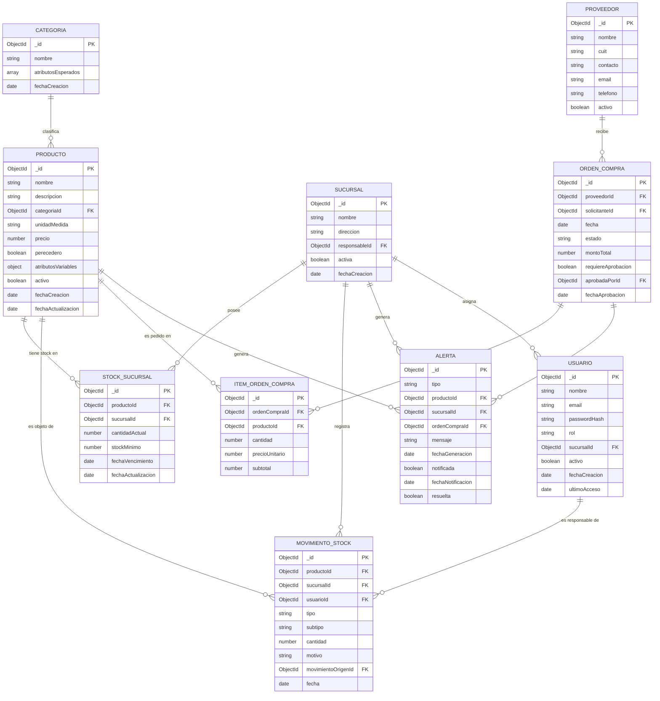

# Esquema de Base de Datos — Sistema de Gestión de Inventario

**Motor:** MongoDB Atlas (base de datos documental / no relacional)
**Grupo 214 — Trabajo Final Integrador**

Al ser un modelo documental, no existen claves foráneas estrictas ni JOINs: las relaciones entre colecciones se resuelven mediante **referencias por `ObjectId`** (patrón *referencing*), resueltas en la capa de backend (Java + Spring Boot) mediante consultas adicionales o `$lookup` (agregaciones) cuando se necesita traer datos combinados.

---

## 1. Diagrama entidad-relación (colecciones)

---

## 2. Detalle de colecciones

### 2.1 `categoria`
Clasifica productos y define qué atributos variables debe tener cada uno (ej. una categoría "Lácteos" espera `fechaVencimiento` y `lote`; "Electrónica" espera `garantiaMeses`).

| Campo | Tipo | Descripción | Clave |
|---|---|---|---|
| `_id` | ObjectId | Identificador único | **PK** |
| `nombre` | string | Nombre de la categoría (único) | — |
| `atributosEsperados` | array\<string\> | Nombres de atributos que deben existir en `producto.atributosVariables` para esta categoría | — |
| `fechaCreacion` | date | Alta del registro | — |

**Índices:** `{ nombre: 1 }` único.

---

### 2.2 `producto`
Catálogo de productos de la cadena (definición lógica; el stock físico vive en `stock_sucursal`).

| Campo | Tipo | Descripción | Clave |
|---|---|---|---|
| `_id` | ObjectId | Identificador único | **PK** |
| `nombre` | string | Nombre del producto | — |
| `descripcion` | string | Descripción opcional | — |
| `categoriaId` | ObjectId | Referencia a `categoria._id` | **FK** → `categoria` |
| `unidadMedida` | string | Ej: "unidad", "kg", "litro" | — |
| `precio` | number (decimal) | Precio de venta/lista | — |
| `perecedero` | boolean | Indica si requiere control de vencimiento | — |
| `atributosVariables` | object (schema-less) | Atributos dependientes de la categoría (ej. `{ lote: "A123", garantiaMeses: 12 }`) | — |
| `activo` | boolean | Baja lógica | — |
| `fechaCreacion` / `fechaActualizacion` | date | Auditoría | — |

**Índices:** `{ categoriaId: 1 }`, `{ nombre: "text" }` (búsqueda), `{ activo: 1 }`.

---

### 2.3 `sucursal`
Sucursales de la cadena (actualmente 3).

| Campo | Tipo | Descripción | Clave |
|---|---|---|---|
| `_id` | ObjectId | Identificador único | **PK** |
| `nombre` | string | Nombre/código de la sucursal | — |
| `direccion` | string | Dirección física | — |
| `responsableId` | ObjectId | Referencia al `usuario` encargado | **FK** → `usuario` |
| `activa` | boolean | Baja lógica | — |
| `fechaCreacion` | date | Auditoría | — |

**Índices:** `{ nombre: 1 }` único.

---

### 2.4 `stock_sucursal`
Stock físico de un producto en una sucursal puntual. Separa la definición del producto de su cantidad real por local.

| Campo | Tipo | Descripción | Clave |
|---|---|---|---|
| `_id` | ObjectId | Identificador único | **PK** |
| `productoId` | ObjectId | Referencia a `producto._id` | **FK** → `producto` |
| `sucursalId` | ObjectId | Referencia a `sucursal._id` | **FK** → `sucursal` |
| `cantidadActual` | number (int) | Cantidad disponible (nunca negativa) | — |
| `stockMinimo` | number (int) | Umbral configurable para disparar alertas | — |
| `fechaVencimiento` | date \| null | Solo si el producto es perecedero | — |
| `fechaActualizacion` | date | Última modificación derivada de un movimiento | — |

**Índices:**
- `{ productoId: 1, sucursalId: 1 }` **único compuesto** (un solo registro de stock por producto+sucursal).
- `{ sucursalId: 1, cantidadActual: 1 }` (consultas de stock bajo por sucursal).
- `{ fechaVencimiento: 1 }` (job de alertas de vencimiento).

---

### 2.5 `movimiento_stock`
Registro histórico e **inmutable (append-only)** de toda entrada/salida. El stock en `stock_sucursal` se actualiza como consecuencia de insertar un movimiento; nunca se edita el stock directamente.

| Campo | Tipo | Descripción | Clave |
|---|---|---|---|
| `_id` | ObjectId | Identificador único | **PK** |
| `productoId` | ObjectId | Referencia a `producto._id` | **FK** → `producto` |
| `sucursalId` | ObjectId | Referencia a `sucursal._id` | **FK** → `sucursal` |
| `usuarioId` | ObjectId | Usuario responsable del movimiento | **FK** → `usuario` |
| `tipo` | string (enum) | `"ENTRADA"` \| `"SALIDA"` | — |
| `subtipo` | string (enum) | `"COMPRA"`, `"TRANSFERENCIA"`, `"DEVOLUCION"`, `"VENTA"`, `"MERMA"`, `"VENCIMIENTO"`, `"AJUSTE"` | — |
| `cantidad` | number (int, > 0) | Cantidad afectada | — |
| `motivo` | string | Observación libre | — |
| `movimientoOrigenId` | ObjectId \| null | Si es un ajuste inverso, referencia al movimiento anulado | **FK** → `movimiento_stock` (self) |
| `fecha` | date | Fecha/hora del movimiento | — |

**Índices:** `{ sucursalId: 1, fecha: -1 }`, `{ productoId: 1, fecha: -1 }`, `{ usuarioId: 1 }`.

---

### 2.6 `usuario`
Usuarios del sistema (autenticación y autorización por rol).

| Campo | Tipo | Descripción | Clave |
|---|---|---|---|
| `_id` | ObjectId | Identificador único | **PK** |
| `nombre` | string | Nombre completo | — |
| `email` | string | Usado como login (único) | — |
| `passwordHash` | string | Hash de contraseña (bcrypt) | — |
| `rol` | string (enum) | `"ADMIN_CENTRAL"` \| `"ENCARGADO_SUCURSAL"` | — |
| `sucursalId` | ObjectId \| null | Sucursal asignada (null para admin central) | **FK** → `sucursal` |
| `activo` | boolean | Baja lógica | — |
| `fechaCreacion` / `ultimoAcceso` | date | Auditoría | — |

**Índices:** `{ email: 1 }` único.

---

### 2.7 `proveedor`

| Campo | Tipo | Descripción | Clave |
|---|---|---|---|
| `_id` | ObjectId | Identificador único | **PK** |
| `nombre` | string | Razón social | — |
| `cuit` | string | Identificación fiscal (único) | — |
| `contacto` | string | Persona de contacto | — |
| `email` / `telefono` | string | Datos de contacto | — |
| `activo` | boolean | Baja lógica | — |

**Índices:** `{ cuit: 1 }` único.

---

### 2.8 `orden_compra`

| Campo | Tipo | Descripción | Clave |
|---|---|---|---|
| `_id` | ObjectId | Identificador único | **PK** |
| `proveedorId` | ObjectId | Referencia a `proveedor._id` | **FK** → `proveedor` |
| `solicitanteId` | ObjectId | Usuario que generó la orden | **FK** → `usuario` |
| `fecha` | date | Fecha de emisión | — |
| `estado` | string (enum) | `"PENDIENTE"`, `"APROBADA"`, `"RECHAZADA"`, `"RECIBIDA"`, `"CANCELADA"` | — |
| `montoTotal` | number (decimal) | Suma de `item_orden_compra.subtotal` | — |
| `requiereAprobacion` | boolean | true si `montoTotal` supera el umbral configurado | — |
| `aprobadaPorId` | ObjectId \| null | Referencia al admin que aprobó | **FK** → `usuario` |
| `fechaAprobacion` | date \| null | — | — |

**Índices:** `{ proveedorId: 1 }`, `{ estado: 1 }`.

---

### 2.9 `item_orden_compra`
Detalle (renglones) de cada orden de compra.

| Campo | Tipo | Descripción | Clave |
|---|---|---|---|
| `_id` | ObjectId | Identificador único | **PK** |
| `ordenCompraId` | ObjectId | Referencia a `orden_compra._id` | **FK** → `orden_compra` |
| `productoId` | ObjectId | Referencia a `producto._id` | **FK** → `producto` |
| `cantidad` | number (int) | Cantidad solicitada | — |
| `precioUnitario` | number (decimal) | Precio pactado con el proveedor | — |
| `subtotal` | number (decimal) | `cantidad * precioUnitario` | — |

**Índices:** `{ ordenCompraId: 1 }`.

> *Alternativa de diseño:* `item_orden_compra` podría embeberse como array dentro de `orden_compra` (patrón *embedding*), ya que se accede siempre junto con la orden. Se optó por colección separada para simplificar actualizaciones parciales y mantener el documento de orden liviano.

---

### 2.10 `alerta`
Centraliza alertas de stock mínimo, vencimiento próximo y aprobación de montos, para notificación unificada vía Brevo.

| Campo | Tipo | Descripción | Clave |
|---|---|---|---|
| `_id` | ObjectId | Identificador único | **PK** |
| `tipo` | string (enum) | `"STOCK_MINIMO"`, `"VENCIMIENTO_PROXIMO"`, `"APROBACION_MONTO"` | — |
| `productoId` | ObjectId \| null | Referencia a `producto._id` | **FK** → `producto` |
| `sucursalId` | ObjectId \| null | Referencia a `sucursal._id` | **FK** → `sucursal` |
| `ordenCompraId` | ObjectId \| null | Referencia a `orden_compra._id` (para aprobación de montos) | **FK** → `orden_compra` |
| `mensaje` | string | Texto descriptivo de la alerta | — |
| `fechaGeneracion` | date | Momento en que se disparó | — |
| `notificada` | boolean | Si ya se envió el email vía Brevo | — |
| `fechaNotificacion` | date \| null | — | — |
| `resuelta` | boolean | Si la condición que la originó ya fue subsanada | — |

**Índices:** `{ notificada: 1, fechaGeneracion: 1 }` (cola de envío), `{ sucursalId: 1, resuelta: 1 }`.

---

## 3. Resumen de relaciones lógicas

| Relación | Cardinalidad | Tipo de vínculo |
|---|---|---|
| Categoría → Producto | 1 : N | Referencia (`producto.categoriaId`) |
| Producto → Stock_Sucursal | 1 : N | Referencia (`stock_sucursal.productoId`) |
| Sucursal → Stock_Sucursal | 1 : N | Referencia (`stock_sucursal.sucursalId`) |
| Producto → Movimiento_Stock | 1 : N | Referencia (`movimiento_stock.productoId`) |
| Sucursal → Movimiento_Stock | 1 : N | Referencia (`movimiento_stock.sucursalId`) |
| Usuario → Movimiento_Stock | 1 : N | Referencia (`movimiento_stock.usuarioId`) |
| Sucursal → Usuario | 1 : N | Referencia (`usuario.sucursalId`) |
| Proveedor → Orden_Compra | 1 : N | Referencia (`orden_compra.proveedorId`) |
| Orden_Compra → Item_Orden_Compra | 1 : N | Referencia (`item_orden_compra.ordenCompraId`) |
| Producto → Item_Orden_Compra | 1 : N | Referencia (`item_orden_compra.productoId`) |
| Producto / Sucursal / Orden_Compra → Alerta | 1 : N | Referencia |

## 4. Índices principales (resumen)

| Colección | Índice | Propósito |
|---|---|---|
| `categoria` | `nombre` (único) | Evitar duplicados |
| `producto` | `categoriaId`, `nombre` (texto), `activo` | Filtrado y búsqueda |
| `sucursal` | `nombre` (único) | Evitar duplicados |
| `stock_sucursal` | `productoId + sucursalId` (único compuesto) | Un solo stock por par producto-sucursal |
| `stock_sucursal` | `sucursalId + cantidadActual` | Alertas de stock mínimo |
| `stock_sucursal` | `fechaVencimiento` | Alertas de vencimiento |
| `movimiento_stock` | `sucursalId + fecha desc`, `productoId + fecha desc` | Reportes y trazabilidad |
| `usuario` | `email` (único) | Login |
| `proveedor` | `cuit` (único) | Evitar duplicados |
| `orden_compra` | `proveedorId`, `estado` | Filtrado de compras |
| `alerta` | `notificada + fechaGeneracion` | Cola de notificaciones pendientes |

## 5. Reglas de consistencia aplicadas a nivel de datos

1. El stock (`stock_sucursal.cantidadActual`) **nunca es negativo** y solo se modifica insertando un documento en `movimiento_stock` (transacción atómica a nivel aplicación/MongoDB `session`).
2. `movimiento_stock` es **append-only**: no se actualizan ni eliminan documentos; una anulación crea un nuevo movimiento de ajuste inverso referenciado por `movimientoOrigenId`.
3. `producto.atributosVariables` es *schema-less* y su forma esperada depende de `categoria.atributosEsperados` (validación a nivel aplicación, no a nivel de esquema fijo).
