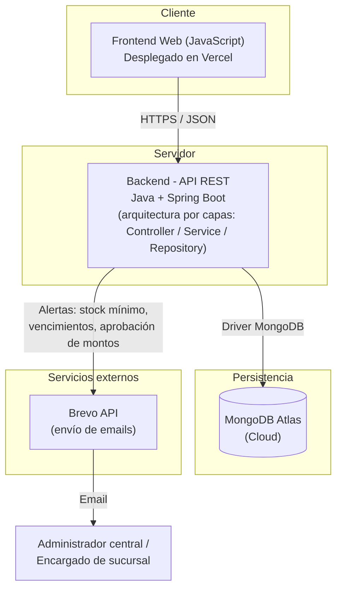
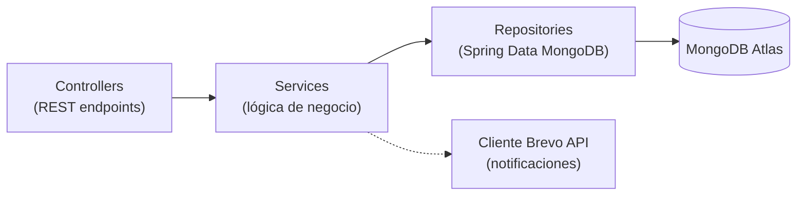

# Arquitectura del Proyecto

**Sistema de Gestión de Inventario — Cadena de Almacenes | Grupo 214**

## 1. Estilo arquitectónico

Se adopta una **arquitectura en 3 capas, desacoplada (frontend/backend independientes) y comunicada vía API REST**:



No se optó por microservicios: el dominio (inventario de una cadena de 3 sucursales) no justifica la complejidad operativa adicional (orquestación, comunicación entre servicios, despliegues independientes) que aportaría poco valor frente al tamaño del equipo y del proyecto. Dentro del backend monolítico se aplica **arquitectura en capas** (estilo similar a MVC, adaptado a una API sin vistas server-side):

```
Controller (REST endpoints)
      ↓
Service (lógica de negocio: validaciones de stock, reglas de alertas, permisos)
      ↓
Repository (acceso a datos vía Spring Data MongoDB)
      ↓
MongoDB Atlas
```

- **Controller:** expone los endpoints REST por recurso (`/productos`, `/sucursales`, `/stock`, `/movimientos`, `/proveedores`, `/ordenes-compra`, `/usuarios`, `/alertas`), recibe/valida el request y delega en el Service.
- **Service:** concentra la lógica de negocio (reglas de negocio del README: stock nunca negativo, generación de alertas, control de permisos por rol, cálculo de aprobación de montos).
- **Repository:** interfaces de acceso a MongoDB (Spring Data MongoDB), una por colección.
- **Model/DTO:** entidades de dominio (mapeadas a documentos) y objetos de transferencia expuestos por la API.

## 2. Tecnologías definitivas

| Capa | Tecnología | Justificación |
|---|---|---|
| **Frontend** | JavaScript (SPA) | Lenguaje ya utilizado por el equipo durante la carrera; reduce la curva de aprendizaje y acelera la entrega del MVP dentro de los plazos del trabajo final. |
| **Backend** | Java 17 + Spring Boot | Framework maduro para aplicaciones empresariales con lógica de negocio no trivial (control de stock multi-sucursal, reglas de aprobación); tipado fuerte, ecosistema de seguridad (Spring Security) y ya visto en la carrera. |
| **Base de datos** | MongoDB Atlas (documental) | Esquema flexible: los productos tienen atributos variables según su categoría (ej. vencimiento y lote en perecederos vs. garantía en electrónica) sin necesidad de migraciones rígidas de esquema a medida que el catálogo crece. |
| **Notificaciones** | Brevo (API REST de email transaccional) | Integración simple vía API REST para alertas de stock mínimo, vencimiento y aprobación de montos, sin mantener infraestructura propia de envío de correo. |
| **Control de versiones** | Git + GitHub | Estándar de la industria, cumple el requisito de repositorio único centralizado exigido por la cátedra, con historial de commits trazable por integrante. |
| **Despliegue frontend** | Vercel | Despliegue continuo simple para aplicaciones JavaScript, integrado con GitHub. |
| **Despliegue backend** | API REST propia (Spring Boot) | Expuesta públicamente para ser consumida por el frontend desplegado en Vercel. |

## 3. Justificación de las decisiones técnicas

1. **Frontend/backend desacoplados vía REST:** permite desarrollar, testear y desplegar cada capa de forma independiente, y facilita que distintos integrantes del equipo trabajen en paralelo (backend por un lado, pantallas por otro) sin bloquearse mutuamente.
2. **Base de datos documental (MongoDB) en lugar de relacional:** la variabilidad de atributos por categoría de producto (RF-01) es más natural de modelar con documentos flexibles que con tablas rígidas y múltiples JOINs o columnas nulas. Además, el equipo prioriza no tener que definir migraciones de esquema durante el desarrollo iterativo del MVP.
3. **Movimientos de stock como registro inmutable (append-only):** garantiza trazabilidad y auditoría (regla de negocio del README) y evita inconsistencias que surgirían de editar el stock de forma directa.
4. **Stock por sucursal, no global:** cada sucursal opera de forma autónoma sobre su propio stock; el total consolidado a nivel cadena se calcula (vista/reporte), no se almacena, evitando duplicación de la fuente de verdad.
5. **Colección `alerta` centralizada:** unifica el envío de notificaciones (stock mínimo, vencimiento, aprobación de montos) en un solo mecanismo, simplificando la integración con Brevo y permitiendo reintentos si el envío de email falla.
6. **Autenticación y autorización por rol a nivel de backend:** el control de acceso (RNF-04) se centraliza en la API, no en el frontend, para que ninguna regla de seguridad dependa del cliente.

## 4. Requerimientos no funcionales cubiertos por la arquitectura

| RNF | Cómo lo cubre la arquitectura |
|---|---|
| RNF-01 (accesible desde distintos tamaños de pantalla) | Frontend SPA responsive, independiente del backend. |
| RNF-02 (trabajo concurrente entre sucursales) | Operaciones atómicas de MongoDB al actualizar `stock_sucursal` junto con la inserción del `movimiento_stock`. |
| RNF-04 (control de acceso por rol) | Capa de autorización en el backend (Spring Security), validada en cada endpoint. |
| RNF-05 (datos sensibles seguros) | Hash de contraseñas (bcrypt) y variables de entorno para credenciales (Mongo URI, API key de Brevo). |
| RNF-06 (escalable ante nuevas sucursales) | Alta de una nueva `sucursal` no requiere cambios estructurales: es un documento más, con su propio stock referenciado. |
| RNF-07 (repositorio único versionado) | Un solo repositorio GitHub con frontend, backend, base de datos y documentación. |
| RNF-08 (desplegado públicamente) | Frontend en Vercel, backend expuesto como API REST pública. |

## 5. Diagrama de estructura por capas (backend)


